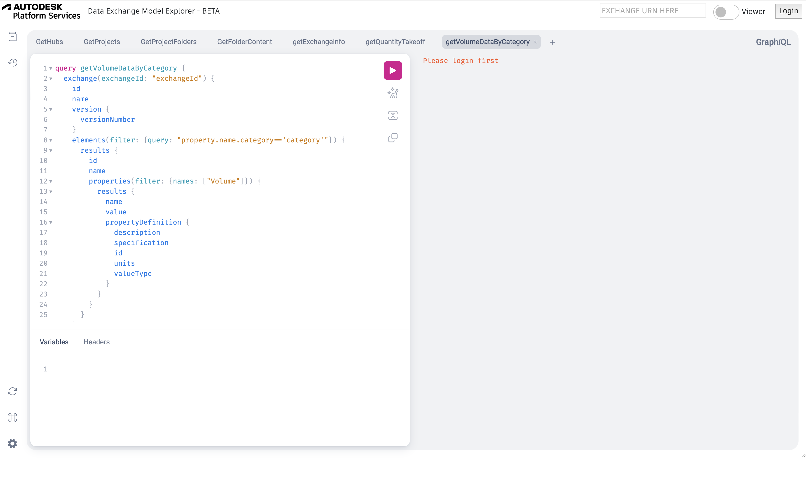
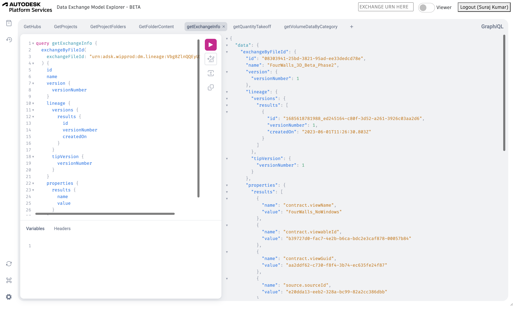
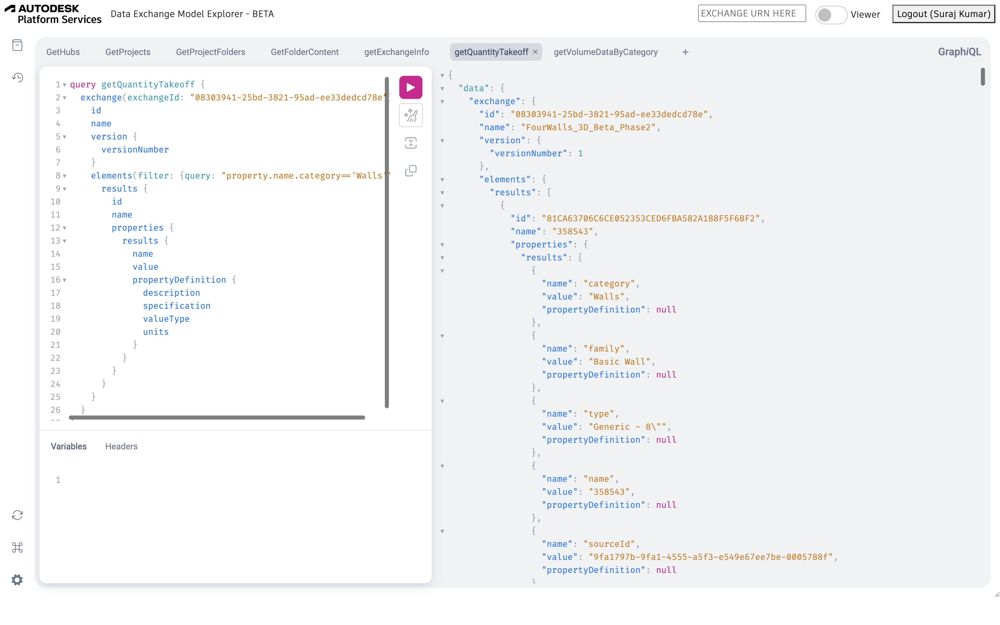
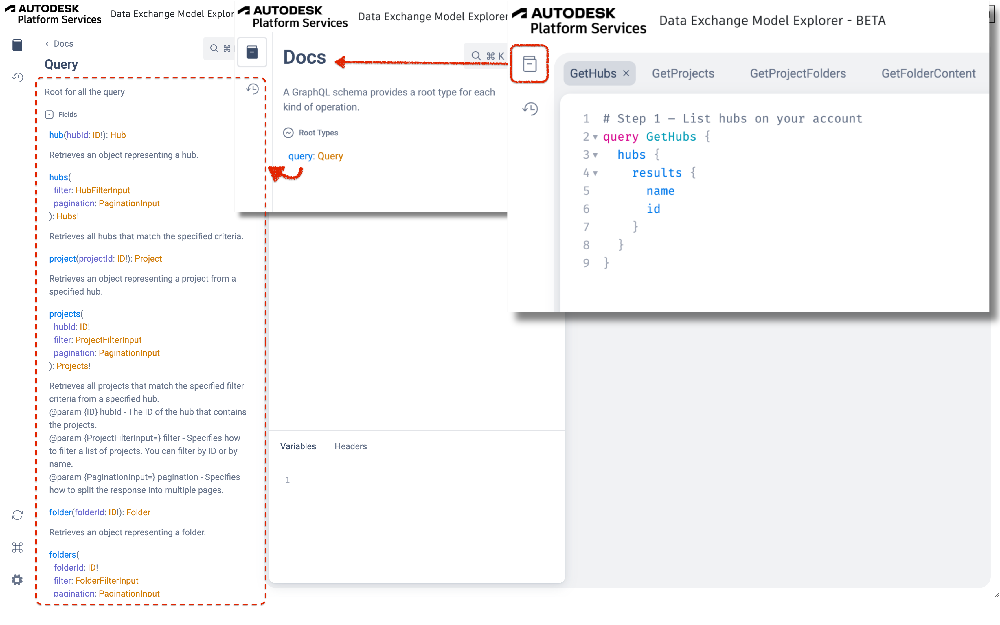
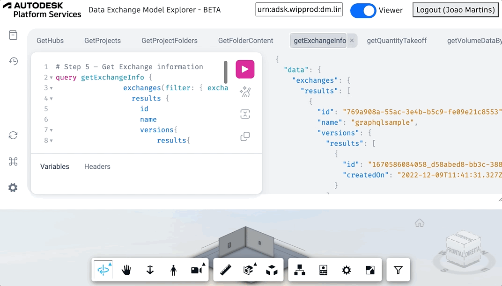
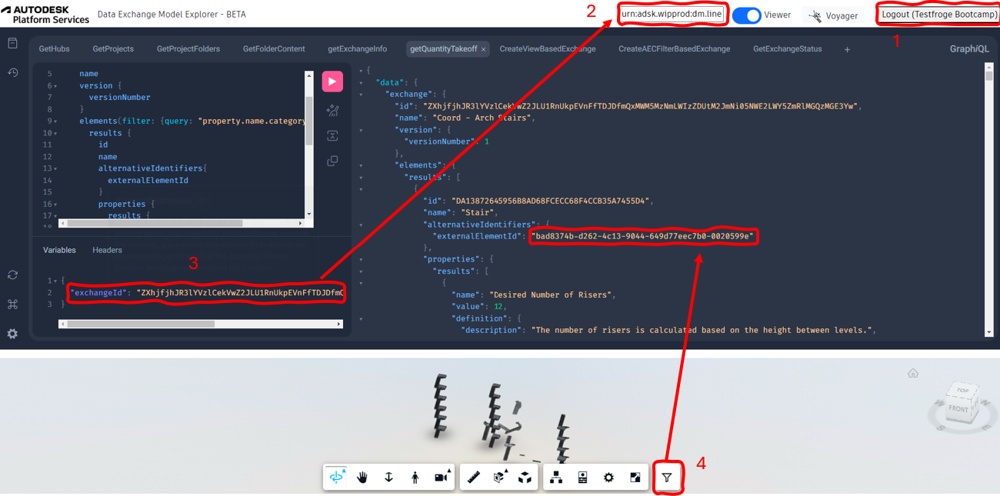

# Aps Data Exchange Explorer

The sample is using this [GraphiQL project](https://github.com/graphql/graphiql) that makes it really easy to discover the Data Exchange API through GraphQL.
It also integrates with the Viewer in order contextualize the query results.

# Thumbnail



## Setting up the app

- clone this repository or download
- restore the packages
- replace the variable values at appsettings.Development.json with your own

```json
{
  "APS_CLIENT_ID": "YOUR CLIENT ID",
  "APS_CLIENT_SECRET": "YOUR CLIENT SECRET",
  "APS_CALLBACK_URL": "http://localhost:8080/api/auth/callback"
}
```

**Make sure your APS app also uses the same callback url!**

## Running the app

As instructed in the console, you'll need to open a web browser and navigate to http://localhost:8080 in order to log into your Autodesk account

## Output

Once you logged in with your Autodesk account in the browser, this should appear:



This sample comes by default with the step-by-step tutorial queries in multiple tabs. You can run the queries available in these tabs and add your own.



You can also check the documentation



Viewer is controlled by the toggle switch in the header. It will load the model based on the item or version Id specified by the input.



---

## Known issues

1. The Viewer might have some trouble on resizing on Safari. Please use it with Chrome or Edge.

## Tips & Tricks



1. **You need to be logged in order to use any feature in this sample.**
2. **Exchange URN field accepts URN of an exchange. From there, it'll load the view in the Viewer based on the exchange's contract**
3. **Make sure the Exchange Id and URN are related to the same exchange.**
4. **The filter extension looks for source ids in the last query response, then look for externalIds in the loaded model to isolate them.**

## Troubleshooting

1. **Cannot load viewer**: Make sure you're logged in and using a valid exchange Id.

2. **Filter Extension doesn't highlight elements**: Make sure you're using the exchange urn compatible with the exchange id used in the queries.

## Written and updated by

- João Martins [@JooPaulodeOrne2](http://twitter.com/JooPaulodeOrne2), [Developer Advocate and Support](http://aps.autodesk.com)
- Suraj Kumar [@suraj0223](https://www.linkedin.com/in/suraj0223/), [Software Developer]
- Denis Grigor  [Developer Advocate and Support](http://aps.autodesk.com)
